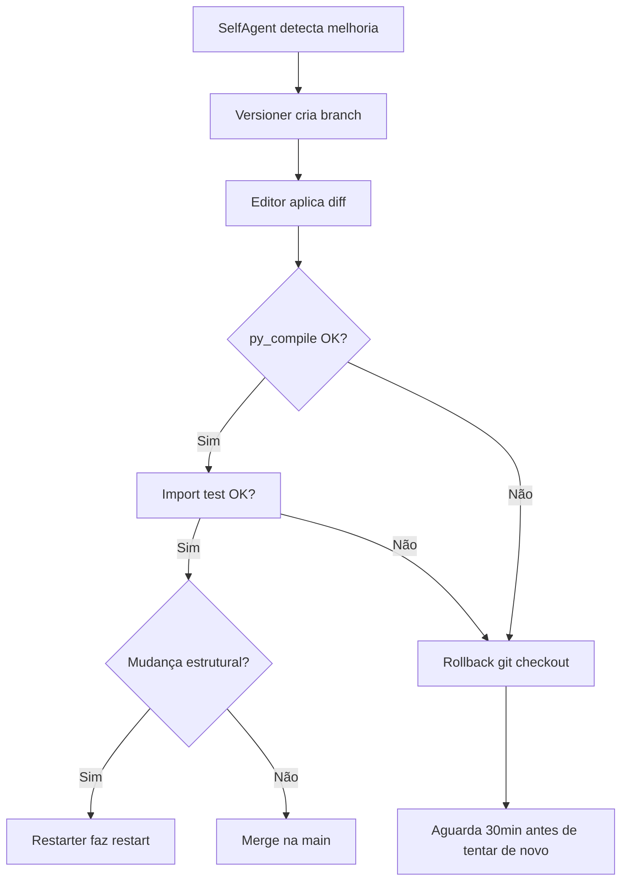

# Self-Evolution — Jarvis Auto-Melhoria

## Visão Geral

Jarvis deve ser capaz de ler, analisar, modificar e melhorar o próprio código-fonte de forma autônoma, incluindo edição de arquivos `.py`, gerenciamento de dependências, modificação de configurações do sistema (systemd, scripts de inicialização) e reinicialização segura.

## Nível de Autonomia

- **Total** — Jarvis decide, modifica, testa e aplica sem intervenção humana
- Limites de segurança aplicados via Guard (taxa máxima, whitelist, rollback automático em falha)

## Arquitetura

### 1. SelfAgent (`agent/self_evolve.py`)

**Responsabilidade:** Identificar oportunidades de melhoria no próprio código.

- Lê código-fonte com `ast.parse()` para análise estrutural
- Usa LLM (llm/ollama_llm.py) com análise de:
  - Bugs potenciais (exceções não tratadas, imports ausentes)
  - Ineficiências (loops desnecessários, lógica redundante)
  - Oportunidades de melhoria (código não utilizado, funções muito longas)
  - Segurança (comandos shell sem sanitização, paths hardcoded)
- Gera `EvolvePlan(diff: str, files: list[str], deps: list[str], risk: str, reason: str)`
- Loga o plano em `memory/episodic.py` como episódio de auto-evolução

### 2. Editor (`agent/self_editor.py`)

**Responsabilidade:** Aplicar mudanças no sistema de arquivos com validação sintática.

- Aplica diffs em arquivos usando `difflib` ou edição direta de linhas
- Validação:
  - `py_compile.compile(file)` após cada edição em `.py`
  - Verifica que imports ainda resolvem (`python3 -c "from module import ..."`)
  - Se falhar → rollback imediato via git
- Gerencia dependências:
  - Lê `requirements.txt` atual
  - Adiciona/remove pacotes
  - Roda `pip install --user --break-system-packages`
- Edita configs de sistema (systemd units, `.desktop`, scripts init)

### 3. Versioner (`agent/self_versioner.py`)

**Responsabilidade:** Git como backbone de versionamento e rollback.

- `git init` em `~/jarvis/` se não existir repositório
- Cria branch `self-edit/<timestamp>` para cada evolução
- Commit das mudanças com mensagem descritiva gerada pelo LLM
- Merge na `main` se validação passar
- Rollback automático: `git checkout -- .` + `git branch -D` se falhar

### 4. Guard (`agent/self_guard.py`)

**Responsabilidade:** Limites de segurança e rate limiting.

- Máximo 5 mudanças por hora
- Whitelist de arquivos editáveis:
  - `~/jarvis/**/*.py`
  - `~/jarvis/config/*`
  - `~/jarvis/requirements.txt`
  - `~/.config/systemd/user/jarvis.service`
  - `~/.bashrc` (apenas adicionar/remover entries do Jarvis)
- Novos pacotes pip: se `risk == 'high'`, bloqueia; se `risk == 'medium'`, loga aviso
- Lock file `~/.jarvis/evolve.lock` impede edições concorrentes
- Máximo 3 tentativas consecutivas, depois espera 1 hora

### 5. Restarter (`agent/self_restarter.py`)

**Responsabilidade:** Reiniciar o processo Jarvis após mudanças estruturais.

- Detecta se mudanças exigem restart (novas classes, novos imports, mudanças em `core/`)
- Salva estado atual (memória ativa, timers pendentes) em JSON em `~/jarvis/.state/`
- Spawna novo processo: `python3 ~/jarvis/main.py --resume ~/jarvis/.state/last.json`
- Kill do processo antigo após novo processo confirmar `ready`
- Se novo processo falhar em 10s → aborta restart, mantém processo antigo

## Fluxo Operacional

## Integração com Sistema Existente

- **Orchestrator**: nova tool `self_evolve(goal: str)` exposta como ferramenta #44
- **Memory**: episódios de auto-evolução logados em `EpisodicMemory`
- **Scheduler**: evoluação automática pode ser agendada (ex: toda semana)
- **Config**: `settings.py` ganha `EVOLVE_ENABLED`, `EVOLVE_RISK_LIMIT`, `GIT_REPO_PATH`

## Dependências

- Nenhuma nova dependência — tudo usa stdlib + git

## Segurança

- Guard é a ÚLTIMA linha de defesa — não pode ser modificado por SelfAgent
- Whitelist hardcoded no Guard, não em config
- Lock file impede loop infinito de auto-evolução
- Rollback automático em qualquer erro de compilação/import

## Testes

- `test_self_evolve.py`:
  - Editor aplica diff válido → arquivo compila
  - Editor aplica diff inválido → rollback acontece
  - Versioner cria branch, commita, faz merge
  - Guard bloqueia >5 mudanças/hora
  - Guard bloqueia edição fora da whitelist
  - Restarter spawna novo processo e kill antigo
  - Lock file impede edição concorrente
